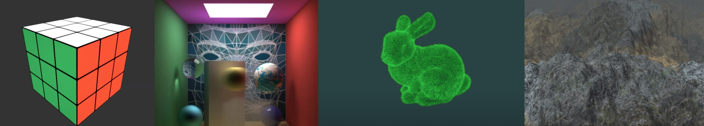
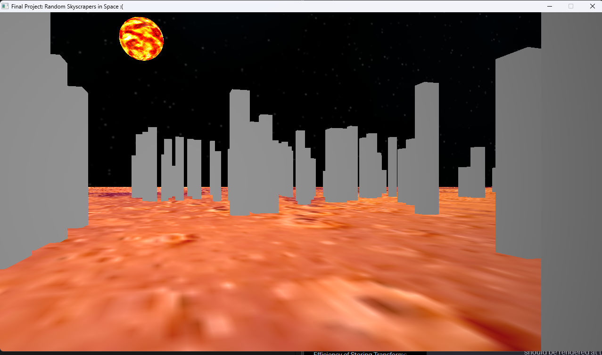

# OpenGL Graphics Engine

## Description

An important part of any computer graphics course, in my opinion, is having the opportunity to build a project that you care about. The final project in my computer graphics couse was a simple OpenGL graphics engine that had a cubemap, textures, and loading .obj files and presenting them on screen as textured polygon meshes. There was a basic (and I mean BASIC) algorithm to randomly create buildings by stretching a cube model and randomly distributing it along the map. 

This project is based off that original project with the hope of expanding on it. :)
  
  
## How to run this project
*1. `cd engine`* 

*2. `python3.11 build/build.py`*

*3. `./main`* 

You can modify [build.py] to your needs, but you should be able to type `python3.11 build.py` and then run the generated executable. You should have SDL 3 as well. 

### Even more Project Ideas

## Project Ideas

* Procedural generation
  * Terrain rendering [https://www.youtube.com/watch?v=QjTPIbJNO6I]
  * City [https://www.youtube.com/watch?v=-d2-PtK4F6Y]
  * Continuous LOD [https://www.youtube.com/watch?v=DUxAyfuJULc]
* Rendering 
  * Photon maps [https://www.youtube.com/watch?v=GckOkpeJ3BY]
  * Radiosity [https://www.youtube.com/watch?v=8i2M255Zw9I]
* Constructive Solid Geometry
  * [https://www.youtube.com/watch?v=-nWPZgxYW-k]
* Build out or extend ray tracer(Our final homework in some iterations of the course): [https://www.youtube.com/watch?v=ijqaBhyXN98]
  * Depth of field
  * Motion blur
* Modeling
  * Progressive Mesh https://www.youtube.com/watch?v=CcomX9UQO1w
  * Subdivision of surfaces [https://www.youtube.com/watch?v=g1M2y1bZOPw]
  * Or the opposite decimation (mesh simplification) [https://www.youtube.com/watch?v=AvSgHhA9yP4]
  * Deformable mesh [https://www.youtube.com/watch?v=r_rkSi8VZj0]
* Volume rendering
  * Example [https://www.youtube.com/watch?v=nmdlGlJ-2G0]
* Animation
  * Flocking behavior [https://www.youtube.com/watch?v=1svKGmGCdXk]
  * Inverse kinematics [https://www.youtube.com/watch?v=uN_pR9fH-WY]
  * Physics-based simulation (e.g. pinball)
  * Collision detection [https://www.youtube.com/watch?v=ZU5PKXxTv8k]
* Particle Simulation [https://www.youtube.com/watch?v=RMfsdUKEmDo]
* Games
  * Build a little First person perspective(shooter, advenutre, etc.) or other interactive environment
  * Racing game [https://www.youtube.com/watch?v=SVzFWnadOdY]
* Shaders
  * Create a world with many different shaders
    * Cel / Toon shaders [https://www.youtube.com/watch?v=RWTQuvXm2HU]
    * Bump / Normal / Parallax / Relief mapping [Example]
  * Deferred rendering [https://www.youtube.com/watch?v=HIrq4sF5QO8]

## Project Hieararchy

### ./engine Directory Organization

- Docs 
    - Source Code Documentation at [Docs/html/index.html](/Engine/Docs/html/index.html)
- Assets
    - Art assets (With the Sub directories music, sound, images)
- src
    - source code(.cpp files)
- include
    - header files(.h and .hpp files)
- lib
    - libraries (.so, .dll, .a, .dylib files). Can statically link SDL3 here if needed.
- bin
    - This is the directory where the built executable(.exe for windows, .app for Mac, or a.out for Linux) and additional lib generated files are put after each build.

**Additional Notes:** 

1. src and include only contain ".cpp" or ".hpp" files. Why? It makes it very fast to do a backup of the project as one example. Secondly, binary files that are generated often clutter up directories